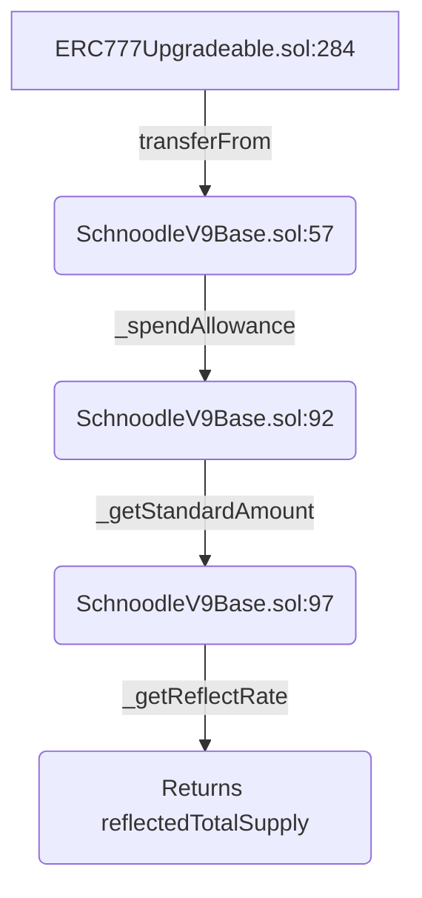

<html>
  <head>
    <script type="text/javascript" async
  src="https://cdnjs.cloudflare.com/ajax/libs/mathjax/2.7.7/MathJax.js?config=TeX-MML-AM_CHTML">
    </script>


<script type="text/javascript" src="https://cdnjs.cloudflare.com/ajax/libs/mathjax/2.7.1/MathJax.js?config=TeX-AMS_HTML">
  MathJax.Hub.Config({
    "HTML-CSS": {
      availableFonts: ["TeX"],
    },
    tex2jax: {
      inlineMath: [['$','$'],["\\(","\\)"]]},
      displayMath: [ ['$$','$$'], ['\[','\]'] ],
    TeX: {
      extensions: ["AMSmath.js", "AMSsymbols.js", "color.js"],
      equationNumbers: {
        autoNumber: "AMS"
      }
    },
    showProcessingMessages: false,
    messageStyle: "none",
    imageFont: null,
    "AssistiveMML": { disabled: true }
  });
</script>
</head>
</html>

------

## Overview 

[Exploit Transaction](https://etherscan.io/tx/0x9a6227ef97d7ce75732645bd604ef128bb5dfbc1bfbe0966ad1cd2870d45a20e)

On Jun-18-2022 (07:05:24 AM +UTC) A [ERC-777 smart contract](https://etherscan.io/address/0xd45740ab9ec920bedbd9bab2e863519e59731941) (Schnoodle, symbol SNOOD) was exploited which resulted in the loss of the entire liquidity contained in the UniswapV2Pair token amounting to around 104 ETH. This attack was performed through an attacker contract that executed a series of interactions with the liquidity token and the above mentioned smart contract during its creation.

Below is the list of all the adresses which were involved in the exploit

## Addresses:

**Attacker**: [0x180ea08644b123d8a3f0eccf2a3b45a582075538](https://etherscan.io/address/0x180ea08644b123d8a3f0eccf2a3b45a582075538)

**Attacker contract**: [0x273521f6582076a5fc54da9af9bfca5435ffe9ec](https://etherscan.io/address/0x273521f6582076a5fc54da9af9bfca5435ffe9ec)

**Schnoodle Proxy**: [0xd45740ab9ec920bedbd9bab2e863519e59731941](https://etherscan.io/token/0xd45740ab9ec920bedbd9bab2e863519e59731941)

**Schnoodle Implementation**: [0xeac2a259f3ebb8fd1097aeccaa62e73b6e43d5bf](https://etherscan.io/address/0xeac2a259f3ebb8fd1097aeccaa62e73b6e43d5bf)

**UniswapV2Pair (SNOOD-WETH)**: [0x0f6b0960d2569f505126341085ed7f0342b67dae](https://etherscan.io/address/0x0f6b0960d2569f505126341085ed7f0342b67dae)

This post aims to explain in detail each transaction that was executed and the vulnerability which reslted in the loss of the tokens.

## Transactions:

First up how does a layman exactly see the series of transactions that ocurred well thats what etherscan is for just serach for the transaction and [this](https://etherscan.io/tx/0x9a6227ef97d7ce75732645bd604ef128bb5dfbc1bfbe0966ad1cd2870d45a20e) is the what how the etherscan output will look like.


Above is the list of all the transactions that ocurred which resulted in the exploit.

Looking at these we can understand that 6 transactions took place but we do not have any idea on what exactly happened, what functions were called, the order in which they were caled the arguements they tok in or the value returned after their execution.

For this we have two tools at our disposal. Which one to use is up to you both have a different way of depicting the transaction details. 

- Using [ethx.info](https://ethtx.info/mainnet/0x9a6227ef97d7ce75732645bd604ef128bb5dfbc1bfbe0966ad1cd2870d45a20e/)
- Using [tenderly](https://dashboard.tenderly.co/tx/mainnet/0x9a6227ef97d7ce75732645bd604ef128bb5dfbc1bfbe0966ad1cd2870d45a20e/debugger?trace=0.5)

Below listed are the exact functions which were called to execute the exploit:


So we see that 6 functions were called corresponding to the etherscan output shown above. Now lets dive deep into each function listing all its arguements, return values and ofcourse its purpose!

---

### #1 balanceOf()

**From**: *0x273521f6582076a5fc54da9af9bfca5435ffe9ec* 

**To**: *0xd45740ab9ec920bedbd9bab2e863519e59731941*

**Argument(s)**: *0x0f6b0960d2569f505126341085ed7f0342b67dae*

**Description**: The attacker contract queries the balance present in the UniswapV2 pair contract.

**Return Value(s)**: 32308960759206669952686933218 schnood

---

### #2 transferFrom()

**From**: *0x273521f6582076a5fc54da9af9bfca5435ffe9ec* 

**To**: *0xd45740ab9ec920bedbd9bab2e863519e59731941*

**Argument(s)**:

- **holder**: *0x0f6b0960d2569f505126341085ed7f0342b67dae*
- **recipient**: *0x273521f6582076a5fc54da9af9bfca5435ffe9ec*
- **amount**: 32308960759206669952686933217

**Description**: This function transfers $balance-1$ schnood from the UniswapV2 pair contract to the attacker contract.
Keep note of this strange amount leaving 1 schnood and taking the rest. We will come back to this again.

---

### #3 Sync()

**From**: *0x273521f6582076a5fc54da9af9bfca5435ffe9ec* 

**To**: *0x0f6b0960d2569f505126341085ed7f0342b67dae*

**Description**: The UniswapV2 pair contract does not have any hooks to automatically update the exchange rates for the pool. The sync function does the job of updating the SNOOD-WETH asset pools exchange rate prices.

The intresting thing to note here is that at this point in the SNOOD-WETH pool there is only 1 SNOOD token to all the WETH balance present, thus exchange rate for SNOOD to WETH is extremely favorable now.

---

### #4 transfer()

**From**: *0x273521f6582076a5fc54da9af9bfca5435ffe9ec*

**To**: *0xd45740ab9ec920bedbd9bab2e863519e59731941*

**Argument(s)**:
- **recipient**: *0x0f6b0960d2569f505126341085ed7f0342b67dae*
  
- **amount**: 32308960759206669952686933217

**Description**: This function transfers all the SNOOD tokens whicih were initially trnasferred from the uniswapv2 pair back to the UniswapV2 pair contract. At this point even though the SNOOD tokens have been added to the pool the exchange rate will still remain the same as the pool reserves have not been updated like in the previous case where the malicious contract called the `sync()` function to update the exchange rate.

---

### #5 getReserves()

**From**: *0x273521f6582076a5fc54da9af9bfca5435ffe9ec*

**To**: *0x0f6b0960d2569f505126341085ed7f0342b67dae*

**Description**: The output of tis function gives us the reserves of each asset present in the uniswap v2 pair pool in this case as you can see below the reserves have not changed and it still shows that only 1 SNOOD token is present in the pool even though the last transaction transferred all the SNOOD tokens back to the pool contract.

**Output**:


---

### #6 swap()

**From**: *0x273521f6582076a5fc54da9af9bfca5435ffe9ec*

**To**: *0x0f6b0960d2569f505126341085ed7f0342b67dae*

**Argument(s)**:
- **amount0Out**: 104047009087796436864
- **amount1Out**: 0
- **to**: *0x180ea08644b123d8a3f0eccf2a3b45a582075538*

**Description** The attacker contract now calls the `swap()` function with the intent of swapping `amount0Outh` amount of weth. Also notice that the `amount0Out` is $\_reserve0-1$. 

```solidity
uint balance0;
uint balance1;
{ // scope for _token{0,1}, avoids stack too deep errors
	address _token1 = token1;
	address _token0 = token0;
	require(to != _token0 && to != _token1, 'UniswapV2: INVALID_TO');
	if (amount0Out > 0) _safeTransfer(_token0, to, amount0Out); // 	optimistically transfer tokens
	if (amount1Out > 0) _safeTransfer(_token1, to, amount1Out); // 	optimistically transfer tokens
...
}
```

On line 8 `amount0Out` is optmistically transferred to the attackers address.

now the balance is updated and the new values are:

```solidity
balance0 = IERC20(_token0).balanceOf(address(this));
//balance0 = 1 wei

balance1 = IERC20(_token1).balanceOf(address(this));
//balance1 = 29732115690897246905537466158 SNOOD
```

Thus the attacker has managed to transfer all but 1 wei from the UniswapV2 pair contract to his wallet address.

Now we have a clear idea of how it happened and what all transactions were executed by the attacker to exploit the vulnerability but what exactly was the bug that caused this transfer to occur in the first place. The vulnerability here lies in the second transaction i.e the `transferFrom()` function

## The Vulnerability

The issue originates from a function that the `transferFrom()` function calls.

Lets look at the call stack of functions called because of `transferFrom()`:

- `transferFrom()` in `ERC777Upgradeable.sol:284`
calls ->
- `_spendAllowance()` in `SchnoodleV9Base.sol:57`
calls ->
- `_getStandardAmount()` in `SchnoodleV9Base.sol:92`
calls ->
- `_getReflectRate()` in `SchnoodleV9Base.sol:97`




Following this trace we can see that the issue originates in the function `_getStandardAmount()` where we can see `_getReflectRate()` is being called and its value is being used in performing integer divison.

```solidity
function _getStandardAmount(uint256 reflectedAmount) internal view returns(uint256) {
    // Condition prevents a divide-by-zero error when the total supply is zero
    return reflectedAmount == 0 ? 0 : reflectedAmount / _getReflectRate();
}
```

As we can see `reflectedAmount` is divided by the return value of `_getReflectRate()` and notice that this is integer division hence if `_getReflectRate()` returns a large enough value such that the numerator is smaller then it results in 0 value and this in turn results in zero allowance being spent on any call to `transferFrom()` effectively allowing anyone calling transferFrom to spend as much money as they want.

In the context of this attack specifically `reflectedAmount` represents the entire amount of balance present in the UniswapV2pair contract minus one i.e 32308960759206669952686933217 this indiactes `_getReflectRate()` must return a very high value for the division to result in 0.

Below we can see the `_getReflectRate()` function:

```solidity
function _getReflectRate() private view returns(uint256) {
    uint256 reflectedTotalSupply = super.totalSupply();
    return reflectedTotalSupply == 0 ? 0 : reflectedTotalSupply / totalSupply();
}
```

As we can see this function divides two variables`ERC777Upgradeable._totalSupply` and `SchnoodleV9Base._totalSupply`.

The value of the numerator `ERC777Upgradeable._totalSupply` is just too high compared to the `_totalSupply` variable in SchnoodleV9Base contract. This results in a large value for the reflectedTotalSupply variable which is in turn returned by `_getReflectRate()` function which is the denominator part in the division mentioned in the `_getStandardAmount()` fucntion thereby resulting in the 0 value on integer divison. 

The root cause of this problem is because of how large these variables have been set at the time of contract intilisation.

Lets take a look at how `ERC777Upgradeable._totalSupply` and `SchnoodleV9Base._totalSupply` are set at the time of contract intialisation.

Both these values are set in the `SchnoodleV9Base.initialize()` fucntion:

```solidity
function initialize(uint256 initialTokens, address serviceAccount) public initializer {
    __Ownable_init();
    _totalSupply = initialTokens * 10 ** decimals();
    __ERC777PresetFixedSupply_init("Schnoodle", "SNOOD", new address[](0), MAX - (MAX % totalSupply()), serviceAccount);
}
```

Here we will need to refer the etherscan output on contract initialization to get the value of `initialTokens` looking at [this](https://etherscan.io/tx/0x41289015f9418a7dfa49349ef17a297b24d97e2bb5bcdc37bc80cf3f16169364) transaction we can see that the `initialize()` function is called with `initialTokens` set to a value of $1000000000000$. 

Now knowing the value of `initialTokens` we can calculate the value of both the `_totalSupply` variables:

- `SchnoodleV9Base._totalSupply` = $1000000000000*10^{18}$ = $1000000000000000000000000000000$
- `ERC777Upgradeable._totalSupply` = $(2^{256}-1) - ((2^{256}-1) \mod 100000000000 * 10^{18})$ = $115792089237316195423570985008687907853269984665000000000000000000000000000000$

Thus we can see how large the numerator is compared to the denominator resulting in the large value of the denominator in the the `_getStandardAmount()` func. and thus leading to the bug.

In short the `transferFrom()` was wrongly implemented resulting in the hack.