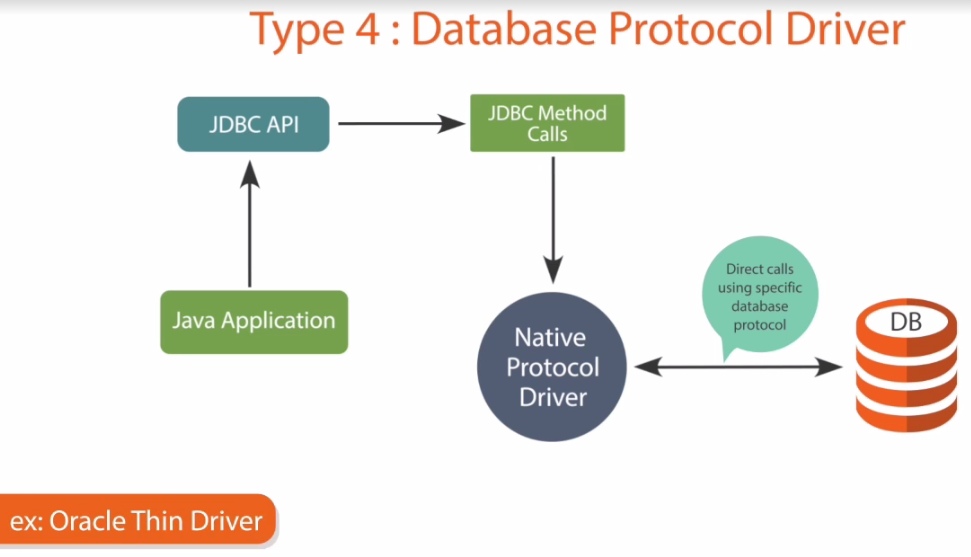

# E-Hub-Software-company-database
An implemetation of a software company database and with added functionalities. Backend implemented in sql and frontend created with java swing using JDBC to connect backend to frontend

link to [Project Documentation](https://drive.google.com/file/d/1CJerirHTqw2HPQ1wP8521Y9Gay244b9f/view?usp=sharing)

## Usage Instructions [for linux machines]
 Clone the repository copy the src/ folder to your local machine and add the sql dump to your databse

## Steps to recover db from sql dump

To recover db from a MySQL dump, enter:

`mysql -u [user] -p [database_name] < [filename].sql`

Make sure to include `[database_name]` and `[filename]` in the path.

It’s likely that on the host machine, `[database_name]` can be in a root directory, so you may not need to add the path. Make sure that you specify the exact path for the dump file you’re restoring, including server name (if needed).

 

